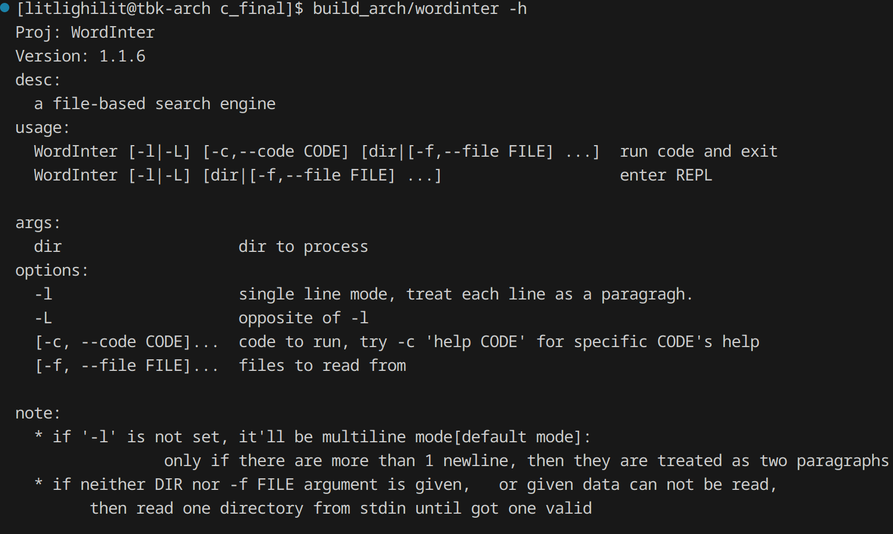
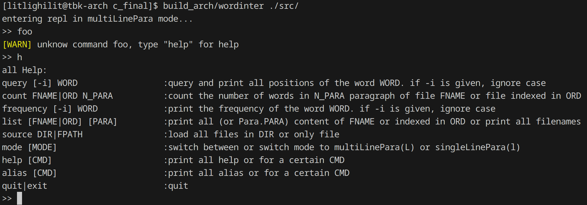

# WordInter
## Desc
A files-based word search engine interpreter,

supporting:

- access file content in paragraphs
- query all occupations of one word
- count the number of words within one paragraphs
- ...(see [`src/interpreter.c`](src/interpreter.c))

Running in both CLI mode or REPL mode:

### CLI


---

### REPL



## Factors

### Runtime
- color ouput (controlled by environment variable)
- allow any numbers of files in input directory
- allow any amount of file contents
- bound checks are round:
	- paragraph index
	- word index
- allow run via either stdin-based [REPL](#repl) or [CLI](#cli)
- when CLI:
	- can handle filenames that contains spaces (given surrounded by quotation marks)

### Compile-time
- target both POSIX and Windows
- build via `make`
- compatiable with C++ (can be compiled via C++ compiler)
- build document via `doxygen`
- self-write a framework of `doctest` for C code, ref [doctest.md](./doctest.md)
- several self-written modules can be used as frameworks, serving for other projects and depends nothing other than this project's modules.

## Compile
### windows (MSVC)
```cmd
make build=build_MSVC
```

Then you get your executable in `./build_MSVC/`

### others
```shell
make
```

Then result lies in `./build/`

---

## Additional info
See also [Difficulties for implementations](./impl.md)

and see [usage tips](/feature-intr.md)
